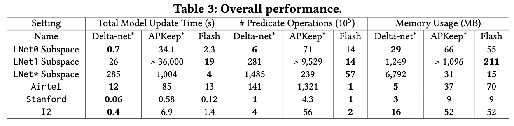
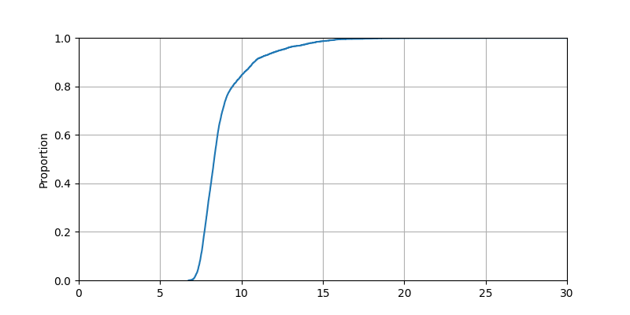
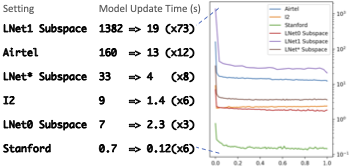
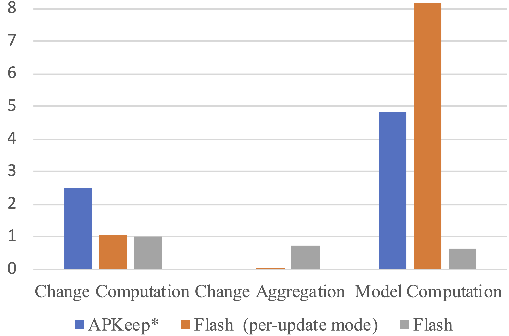

# Flash Artifact for SIGCOMM22 <!-- omit in toc -->

This branch contains the Flash artifact for the evaluations in SIGCOMM22 paper "Flash: Fast, Consistent Data Plane Verification for Large-Scale Network Settings".

**Table of Contents**
- [Environment setup](#environment-setup)
  - [Platform requirements](#platform-requirements)
  - [Get Flash artifact and datasets for evaluation](#get-flash-artifact-and-datasets-for-evaluation)
  - [Build Flash artifact and extract datasets](#build-flash-artifact-and-extract-datasets)
  - [Entrypoint](#entrypoint)
- [SIGCOMM22 Evaluations](#sigcomm22-evaluations)
  - [Effects of Fast IMT](#effects-of-fast-imt)
    - [Overall performance](#overall-performance)
  - [Effects of CE2D](#effects-of-ce2d)
    - [CE2D on OpenR dataset](#ce2d-on-openr-dataset)
    - [Consistent loop detection on OpenR* dataset](#consistent-loop-detection-on-openr-dataset)
    - [Consistent Loop Detection on I2* dataset](#consistent-loop-detection-on-i2-dataset)
    - [All pair reachability check on LNet1 dataset](#all-pair-reachability-check-on-lnet1-dataset)
  - [Micro Benchmark](#micro-benchmark)
    - [Batch size evaluation](#batch-size-evaluation)
    - [Time breakdown](#time-breakdown)

# Environment setup
## Platform requirements
To run the evaluations, the following platform and software suits are required:
* Hardware requirements: A server with 8+ CPU cores and 32GB+ memory is prefered
* Operating system: Ubuntu Server 20.04 (Other operating systems are untested, but should also work as long as the bellow software suits are avaliable)
* JDK 17
* Maven v3.8+
* Git v2.25.1+
* Python v3.8+
* Python3-pip v20.0.0+
* curl v7.68.0+

***Note***:

* Make sure `java` and `mvn` is added to your $PATH environment variable, so that the Flash build script can find them.
* Maven version must be higher than v3.8, else maven does not work with JDK 17.
* The `build.sh` script can help to setup the environment above, please refer to `build.sh` to prepare the environment or follow the following instructions to use `build.sh` directly.
  
## Get Flash artifact and datasets for evaluation

Flash artifact is publicly avaliable, clone the repo to any directory to get all required sources for evaluation.
```
$ git clone https://github.com/snlab/flash.git
```

The evaluations for SIGCOMM22 are in the branch **sigcomm22-artifact**, switch to the repo folder and checkout the branch.

```bash
$ cd flash
$ git checkout sigcomm22-artifact
```


## Build Flash artifact and extract datasets

To ease the evaluation process, we provide a build script to build Flash and prepare the datasets for evaluations.
```bash
$ ./build.sh
```
The `build.sh` script will install all necessary libraries, and download all datasets for evaluations, then build the java project.

***Note***:

The script `build.sh` installs JDK 17 by `apt`, which will ask for geographic information, please input correct zone information while installation.

## Entrypoint
The `./evaluator` file is the entrypoint for all evaluations, which takes an argument `-e` for the evaluation name.
```bash
$ ./evaluator -h
usage: evaluator [-h] -e EVALUATION

options:
  -h, --help     show this help message and exit
  -e EVALUATION  The EVALUATION to be run
```

# SIGCOMM22 Evaluations

## Effects of Fast IMT
### Overall performance

Run the evaluation:
```bash
$ ./evaluator -e overall
```

Expected output:
The evaluation generates a file "overall.txt" lists data corresponding to Table 3 and Figure 6 in paper. 
The consoleMsg.log provides more detailed information.




```bash
$ ./evaluator -e deadSettings
```
Expected output:
It provides an interface to try some settings (in Table 3 and Figure) are not solved within 1-hour.

## Effects of CE2D
### CE2D on OpenR dataset

Run the evaluation:

Execute the following command to run the evaluation:
```bash
$ ./evaluator -e I2CE2D
```
Expected output:

The evaluation generates a scatter figuer in `output/I2CE2D.png` (Figure 7(a) in paper).


### Consistent loop detection on OpenR* dataset

Run the evaluation:

Execute the following command to run the evaluation:
```bash
$ ./evaluator -e I2EarlyDetection
```
Expected output:

The evaluation generates a CDF figuer in `output/I2EarlyDetection.png` (Figure 7(b) in paper).


The figure may vary due to randomness. 

To ease the evaluation process, we use a snapshot of update trace thus the CDF line is different from paper but the results still conform with paper.

### Consistent Loop Detection on I2* dataset

Run the evaluation:

Execute the following command to run the evaluation:
```bash
$ ./evaluator -e I2LongTail
```

Expected output:

The evaluation generates a CDF figuer in `output/I2LongTail{,1}.png` (Figure 7(c/d) in paper).


The figure may vary due to randomness. 

### All pair reachability check on LNet1 dataset

Run the evaluation:

Execute the following command to run the evaluation:
```bash
$ ./evaluator -e LNet1AllPair
```
Expected output:

The evaluation generates a CDF figuer in `output/LNet1AllPair.png` (Figure 8 in paper).




***Note***:
The CDF line of the above figure is smoother than the Figure 8 of the paper due to the code cleaning up. We'll update Figure 8 to the newer result.

## Micro Benchmark
### Batch size evaluation
```bash
$ ./evaluator -e batchSize
$ python3 py/BatchSize.py ./
```

Expected output: 
The first line of command generates few log files, e.g., "LNet0bPuUs.txt". Then one can use the second command to draw a figure `output/batchSize.png` (Figure 9 in paper).



### Time breakdown

```bash
$ ./evaluator -e breakdown
```

Expected output:
The consoleMsg.log provides time break down (Figure 10 in paper).

