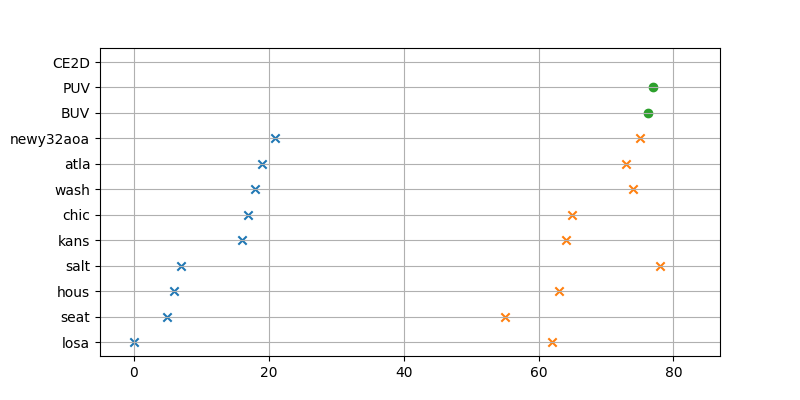
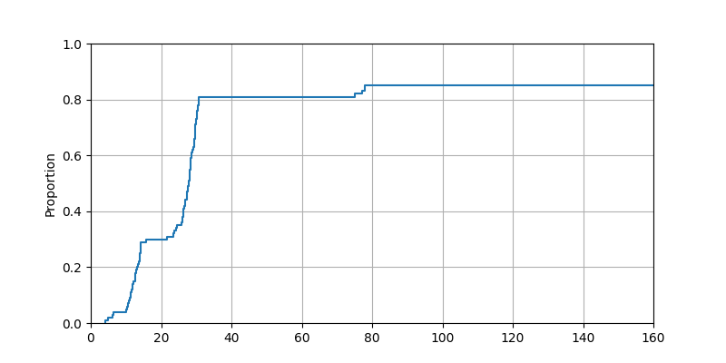
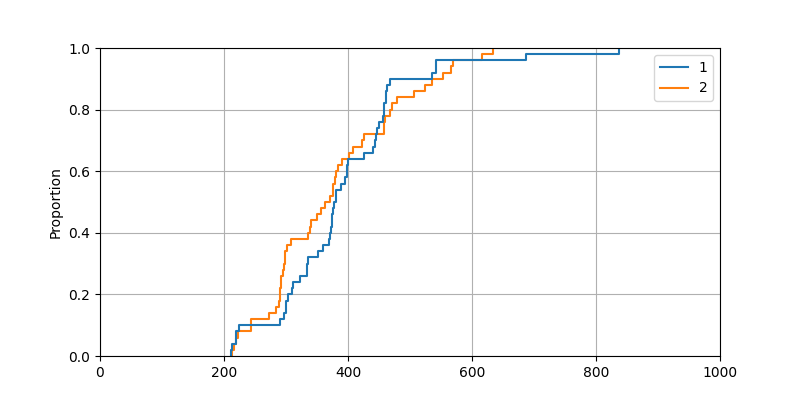
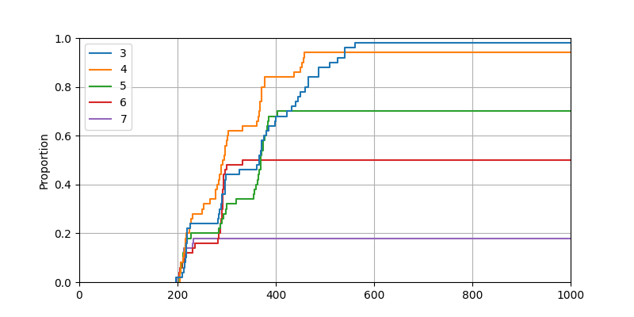
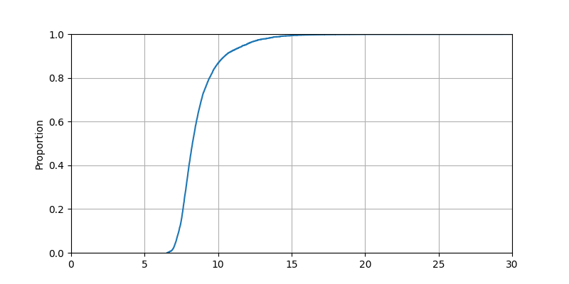

# Flash Artifact for SIGCOMM22 <!-- omit in toc -->

This repo contains the Flash artifact for evaluations in SIGCOMM22 paper "Flash: Fast, Consistent Data Plane Verification for Large-Scale Network Settings".

**Table of Contents**
- [Environment setup](#environment-setup)
  - [Platform requirements](#platform-requirements)
  - [Get Flash and datasets for evaluation](#get-flash-and-datasets-for-evaluation)
  - [Build Flash and extract datasets](#build-flash-and-extract-datasets)
  - [Command line options](#command-line-options)
- [SIGCOMM22 Evaluations](#sigcomm22-evaluations)
  - [Effects of Fast IMT](#effects-of-fast-imt)
  - [Effects of CE2D](#effects-of-ce2d)
    - [CE2D on OpenR dataset](#ce2d-on-openr-dataset)
    - [Consistent loop detection on OpenR* dataset](#consistent-loop-detection-on-openr-dataset)
    - [Consistent Loop Detection on I2* dataset](#consistent-loop-detection-on-i2-dataset)
    - [All pair reachability check on LNet1 dataset](#all-pair-reachability-check-on-lnet1-dataset)
  - [Micro Benchmark](#micro-benchmark)
# Environment setup
## Platform requirements
To run the artifact and run evaluations, the following prefered platform and software suits are required:
* Server hardware requirements: A server with 8+ CPU cores and 32GB+ memory is prefered
* Operating system: Ubuntu Server 20.04 (Other platforms are untested, but should also work as long as bellow software suits are avaliable)
* JDK 17
* Maven v3.8.5+
* Git v2.25.1+
* Python v3.6+

***Note***:

* Make sure `java` and `mvn` is added to your $PATH environment variable, so that the Flash build script can find them.
* Make sure `python3` is the default `python` interpreter.
  
## Get Flash and datasets for evaluation

Flash artifact is publicly avaliable, clone the repo to any directory to get all required sources for evaluation.
```
$ git clone https://github.com/snlab/flash.git
```

## Build Flash and extract datasets
> TODO: split dataset to another repo


To ease the evaluation process, we provide a build script to build Flash and prepare the datasets for evaluation. Switch to the `flash-public` directory and execute:
```bash
$ cd flash
$ git checkout sigcomm22-artifact
$ ./build.sh
```
This script will install all necessary dependent libraries, then build the java project, create a folder `dataset` and download all datasets for evaluation. 


***Note***:

In the following content, the execution directory is `sigcomm22-eval` if not explicitely specified.

## Command line options
Flash provides a set of command line options as listed bellow. You can also use the following command to inspect all avaliable options.
```bash
$ ./evaluator -h
usage: evaluator.py [-h] -e EVALUATION [-o OUTPUT]

options:
  -h, --help     show this help message and exit
  -e EVALUATION  The EVALUATION to be run
  -o OUTPUT      The OUTPUT log file, default: tmp/log.txt
```

> TBD: A table for cmd options.

# SIGCOMM22 Evaluations
## Effects of Fast IMT
> TBD

## Effects of CE2D
### CE2D on OpenR dataset
Dataset description:

To ease the evaluation process, we provide the snapshot of FIB update trace from OpenR using the topology of Internet2.
Each line in `datasets/I2OpenR/trace.txt` uses the follwing format:
```
switchName epochID timestamp prefix mask egress
```
Which is read as "the verifier receives a FIB update from a switch {switchName} at {timestamp}, the FIB update is for IP {prefix}/{mask} going to port {egress} and tagged with {epochID}".

Run the evaluation:

Execute the following command to run the evaluation:
```bash
$ ./evaluator -e I2CE2D
```
Expected output:



### Consistent loop detection on OpenR* dataset

Run the evaluation:

Execute the following command to run the evaluation:
```bash
$ ./evaluator -e I2EarlyDetection
```
Expected output:



### Consistent Loop Detection on I2* dataset

Run the evaluation:

Execute the following command to run the evaluation:
```bash
$ ./evaluator -e I2LongTail
```

Expected output:




### All pair reachability check on LNet1 dataset

Run the evaluation:

Execute the following command to run the evaluation:
```bash
$ ./evaluator -e LNet1AllPair
```
Expected output:





## Micro Benchmark
> TBD